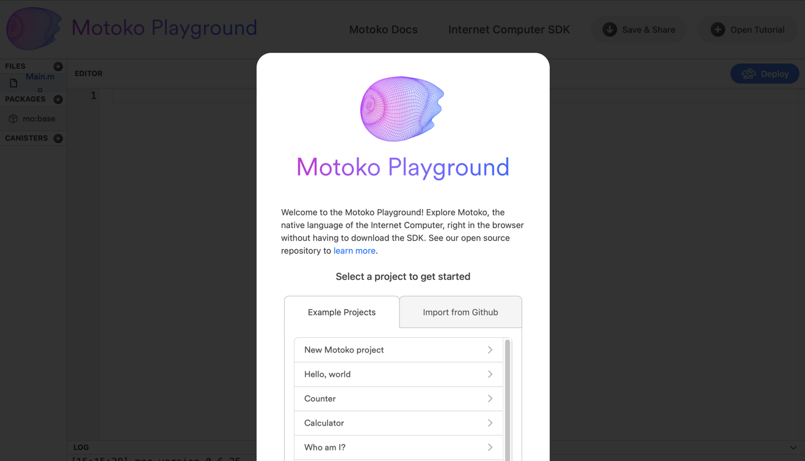
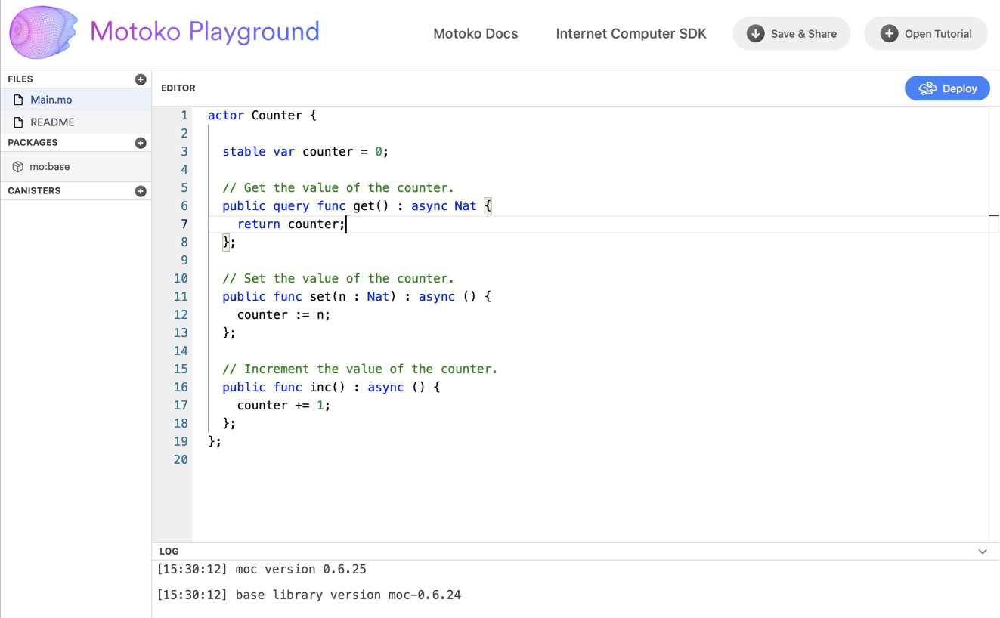
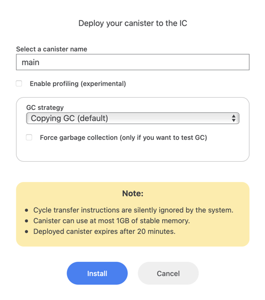
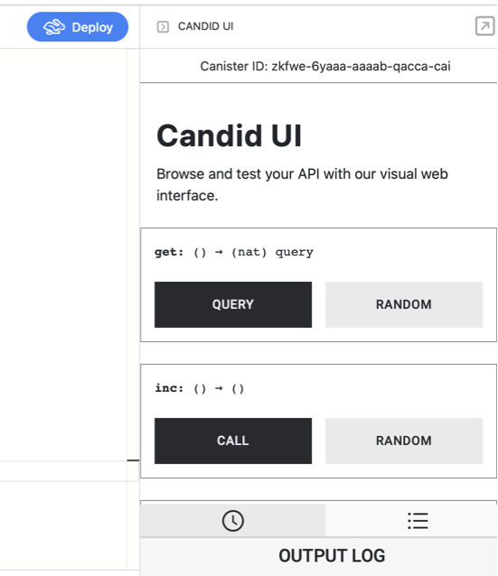

# Getting to know the motoko playground

---

<!-- ## Install - Create - Run -->

Motoko playground is a simple web interface that allows you to write and deploy motoko code in your web browser. It is a #1 choice for developers that just have started getting to know about the Internet Computer ecosystem and want to learn motoko programing language.

> Motoko is a programing language developed natively for the Internet Computer blockchain. If you want to learn more about Motoko, visit the [documentation page](https://smartcontracts.org/docs/language-guide/motoko.html).

## Start first project

You can easily open Motoko playground by visiting this link https://m7sm4-2iaaa-aaaab-qabra-cai.raw.ic0.app/



You should se a modal window simmilar to the screen above that is basically giving you three options:

1. Create a new blank project
2. Open one of the pre-prepared projects 
3. Import code from public Github repo

If you want to start coding from scratch, clicking on New Motoko project is the best option for you. In this tutorial, let's click on the **Counter** example so we can demonstrate how to use the playground. 

This will get you the a Readme file that describes the project and presents how to deploy the code locally on your computer. As Motoko playground is working in the browser, **you don't need to set up your local development enviroment and install the SKD now**. Skip this and just click to the Main.mo file on the left hand side. This will bring you to the code.



This is how your workspace looks. On the left, you can manage files in your project, load packages and other canisters (smart contracts). In the bottom is a little console that shows you logs, this is where you look for error messagess when deploying. In the top right there is a Deploy button that we will use for deploying and testing our code.

## Deploy your code

Counter example is a very simple project to start with. Explaining the code in detail is above the scope of this tutorial but we will briefly go through it just to see what we can expect.

```
actor Counter {

  stable var counter = 0;

  // Get the value of the counter.
  public query func get() : async Nat {
    return counter;
  };

  // Set the value of the counter.
  public func set(n : Nat) : async () {
    counter := n;
  };

  // Increment the value of the counter.
  public func inc() : async () {
    counter += 2;
  };
};

```

The actor has a stable variable counter, that will store the number of the counter and 3 public funcitons – get, set and inc. These functions form a public interface of our canister and we will see them in the generated Candid interface after deploy.

> Candid is an IDL (interface definition language) developed for the IC ecosystem in order to facilitate communication between services written in different programing languages. You can read more about it [here](https://medium.com/dfinity/candid-a-tool-for-interoperable-programming-languages-on-the-internet-computer-27e7085cd97f).

Motoko playground not only allows you to write and deploy your code, it also generates a Candid UI so you can test the functionality. **Click on the deploy button to see it in action**.



First, you need to confirm the deploy by selecting a canister name and set up a garbage collector strategy. You can keep the settings as it is for now and click Install. You should see a success message in the console log.

Motoko Playground is really deploying your canister to the network. As it serves for educational and testing purposes only, there are some limitations such as only 1 GB of data can be used and the canister will expier after 20 minutes. Using this playground is very convinient for new devs learning Motoko, as you don't have to pay for cycles fees for deployment, which you would need to do when deploying to the mainnet directly.
 
## Experiment with Candid UI

If your project deployed successfully, you now should see a Candid UI on your right-hand side.



As we mentioned above, Candid UI follows the interface defined in your Motoko code. You should see a form consisting of three functions get, inc and set. Function get and inc is not expecting any argument so you can click on Query or Call button and experiment with it. Function set is expecting a natural number (Nat) that you can pass in the input field. 

You will notice that query functions have very fast execution usually in terms of miliseconds. On the other hand, functions calling an update usually takes about 2 seconds. 

## Update your code

Once you start practicing Motoko, you will want to update your code frequently. Just click on the Deploy button again, it is going to ask you if you want to Upgrade or Reinstall the code. If you choose update, the stable memory will stay. On the opposite, reinstalling canister will refresh the memory.

If you make significant changes to the code, you might get notified that the update will not be compatible with the previous version and the playground makes you reinstall the whole canister.

Let's make an easy exercise right now. Try to update your code with a new function dec, that will decrease the counter of 1 each time. Remember, the counter should not go below zero.
```
public func dec() : async () {
  if (counter > 0){
      counter -= 1;
  };
}
```

## Save & share your code

You know might want to save your code so you can open it later. You can either save the code and keep in in a local file or click on the Save & Share button in the top-right corner. This will generate you an unique link that you can come back to later.

## Useful resources and links
If you want to experiment with more exapmles of Motoko code. You can again click on the Open tutorial button in the top right corner. More examples can be found in [this GitHub repo](https://github.com/dfinity/examples/tree/master/motoko) which was made by Dfinity foundation. Lastly, there is a no-code Motoko editor [Blocks](https://blocks-editor.github.io/blocks/) which contains some examples too and the Build & Run button will deploy your code via Motoko Playground as well. 

Medium article a Yan Chen from Dfinity Foundation about Motoko Playground:  
https://medium.com/dfinity/introducing-the-motoko-playground-an-online-development-environment-for-the-internet-computer-efb4cd09ea8b

Community converstaion from Dfinity also with Yan Chen about Motoko Playground:  
https://www.youtube.com/watch?v=A_RbxhN0BHI

Link to a Motoko documentation page:  
https://smartcontracts.org/docs/language-guide/motoko.html


