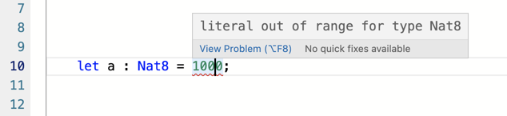

# Primitive data types

Types play a significant role in Motoko language. Compared to modern general purpose languages such as Python, Motoko is very strict about  types. This have a good purpose as it helps preventing Motoko programs to go wrong as mentioned in the [documentation page](https://smartcontracts.org/docs/language-guide/motoko-introduction.html#pitch-types).

>For example, each variable in a Motoko program carries an associated type, and this type is known statically, before the program executes. Each use of each variable is checked by the compiler to prevent runtime type errors, including null reference errors, invalid field access and the like.

## Types in Motoko

Generaly speaking, we can categorize types into two groups: primitive types non-primitive values. This text focuses on primitive types mainly so we will explain them in more detail in the next chapture. To give you the contrast, let's quickly go through the primitive vs non-primitive values.

Primitive types in Motoko programming language are integers, natural numbers floating numbers, characters, texts and booleans.

Example of a primitive type, declaration of a variable that will have type of a natural number an is initialized with the value of 1:

```
let a : Nat = 1;
```

Non-primitive values can be tuples, arrays, objects, variants, functions, async values or error values.

Example of a non-primitive type, declaring an array that b that can only contain natural numbers and is initialized with values 1, 2, 3:
```
let b : [Nat] = [1, 2, 3] ;
```
> You can easily experiment with types and run this sample code in the [Motoko playground](https://m7sm4-2iaaa-aaaab-qabra-cai.raw.ic0.app/) if you are not familiar with it you can follow [Getting to know Motoko Playground](/tutorials/motoko_playground/) tutorial. 

## Primitive types

In this chapter, we will go through all of the primitive types and give you examples of how to declare variables and what can be assigned to them.

### 1. Unbounded Integers

Unbounded integers can be assigned with positive or negative numbers. There are some ways how to declare an integer variable:

```
let a : Int = 1;
let b : Int = -10;
let c : Int = 1_000_000;
let d : Int = 0xf4; // 245
```
Let's make a little exercise now. Write a funciton called add, that will take two integers as arguments and return a sum of these two numbers.
```
public query func add(a : Int, b : Int) : async Int {
    return a+b;
};
```
That was quite easy, right? Try to experiment with it in the Candid UI.


### 2. Unbounded Natural numbers

Unbounded natural numbers can be assigned with positive numbers only. **Motoko program will trap if you try to assign a negative number.**

```
let a : Nat = 1;
let b : Nat = 1_000_000;
let c : Nat = 0xf4; //245
```


### 3. Bounded numbers

Unbounded numbers variables can be assigned theoretically with numbers of any size. There are situations when you don't need this. For example if you want to declare a variable that will represent an age of a person. This variable should never exceed a number greater than 200. You might consider to use a bounded variable to be more memory effective.

In Motoko, these bounded numbers types are available:
- Nat8
- Nat16
- Nat32
- Nat64
- Int8
- Int16
- Int32
- Int64

To explain the pattern, each type consist of Nat/Int and a number. This number represents quantity of bits that will be assigned in memory of the computer for this specific type. For example Nat8 variable can be only assigned with values ranging from 0 to 255. This comes from a formula 2^8 = 256 so the maximum number is 255 as we are starting from 0.

This means that you can declare a variable:
```
let a : Nat8 = 255; // Ok
```

But if you try this your program will fail because we are overflowing the maximum value:
```
let a : Nat8 = 1000; // Not ok
```

If you try to run this program, it will trap. Motoko Playground is well prepared for this type of situations, it doesn't let you execute the program and shows you an explanatory error message:



As integers can also go below zero, we have space for 256 numbers too but in the range from -128 to 127.

```
let a : Int8 = -128; // Ok
let b : Int8 = 127; // Ok
let c : Int8 = -130 // Not ok
let d : Int8 = 250 // Not ok
```

For Nat16 the maximum value that can be assigned is 65 535 (2^16) and for Int16 we have minimum –32768 and maximum –32767. The same logic applies for 32 and 64 size of a type. This gives you understanding of what value can be assigned to a variable of specific type and gives you freedom to decide which one to use when designing your own program.

Keep in mind, even if you have a value that would fit into a smaller size Nat/Int, you can only assign it if it has the same type. Something like this will **not** work in Motoko:
```
let a : Int8 = 10; // Not Ok – Int8 and Int32 types not compatible

let b : Int32 = 789;

public query func add() : async Int32 {
    return a+b;
};
```
### 4. Floating point numbers

For decimal numbers Float type is available in Motoko. Here are some ways how to assign a value to declared float variable:

```
let a : Float = 0;
let b : Float = -10.2;
let c : Float = -0.3e+15;
let d : Float = 3.141_592_653_589_793;
```
### 5. Characters and text

For single characters, there is a type called Char and for strings of characters a Text type. **Be careful, char type must be assigned with single quotes and string types with double qoutes.** Lets try to declare your own variables:

```
let a : Char = 'A'; // Ok
let b : Char = "B"; // Not ok
let c : Text =  "Hello, World!" // Ok
let d : Text = 'Hello, World!' // Not ok
```

Let's create a funciton concat, that will take two strings a and b as arguments and will return a concatenated text of them both with a single space between them.

```
public query func concat(a : Text, b : Text) : async Text {
    return a # " " # b;
};
```
Exactly, you can use the # operator to concatenate strings in Motoko!


### 6. Booleans

For booleans we have a Bool type in Motoko. It can only hold a value either true or false.

```
var a : Bool = true; // Ok
var b : Bool = 1; // Not Ok
``` 
## Useful resources and links

Motoko documentaion page talking about types:  
https://smartcontracts.org/docs/languages/motoko-at-a-glance.html#_primitive_types  

Motoko basic concepts and terms:  
https://smartcontracts.org/docs/language-guide/basic-concepts.html#intro-values  

Motoko base library:  
https://smartcontracts.org/docs/base-libraries/stdlib-intro.html