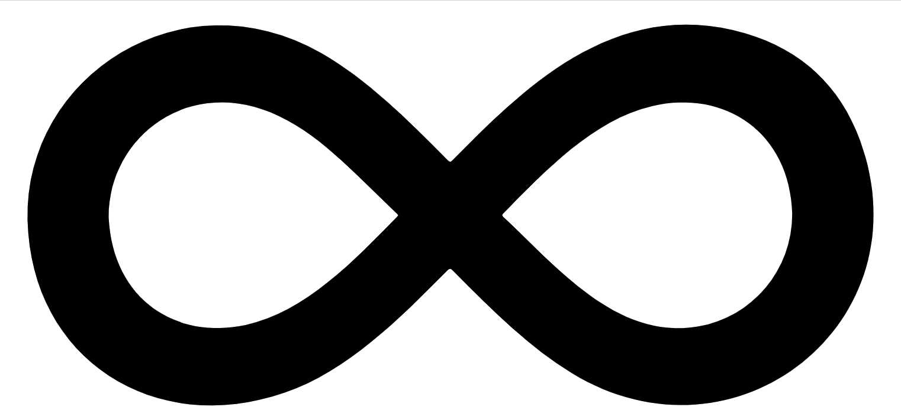
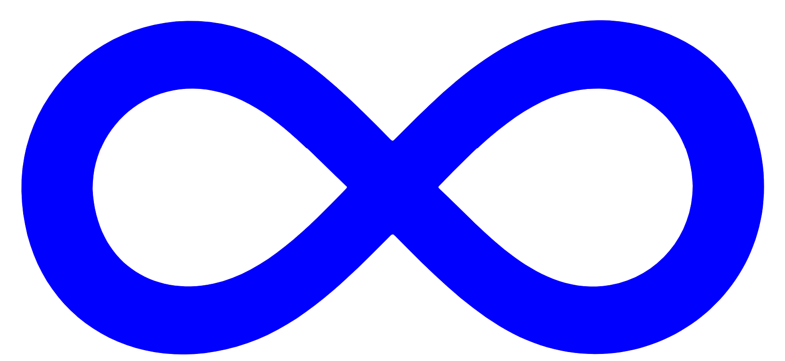

# Serving simple SVG over HTTP

In this tutorial, things are going to get more exciting. We are going to learn how to serve a SVG image over HTTP(s) directly from your canister. **Yes – canisters can serve web content over HTTP!** You are probably familiar with that as it is one of the main advantages of the Internet Computer over the other blockchains. But there is also a **http_request()** function that you can use in Motoko to define how exactly is your canister going to behave when contacted over HTTP protocol.

This could be useful when you want to serve custom SVG images or define a custom api endpoint over the URL. Serving a dynamic NFT file is what we're going to do now.

We are going to use [Motoko Playground](/tutorials/motoko_playground/) for deploying the code, this will give you a quick start without needing to set up your local environment.

## HTTP Requests

We are going to start with this skeleton [template](https://github.com/motoko-bootcamp/bootcamp/blob/main/daily_challenges/day_6/GUIDE.MD#http-request) used for educational purposes during the Motoko Bootcamp event. 

The template contains two files, first the module file http.mo that contains types needed for HTTP communication from the canister.

```
module {
    public type HeaderField = (Text, Text);
    public type Request = {
        body    : Blob;
        headers : [HeaderField];
        method  : Text;
        url     : Text;
    };

    public type Response = {
        body               : Blob;
        headers            : [HeaderField];
        status_code        : Nat16;
        streaming_strategy : ?StreamingStrategy;
    };

      public type StreamingStrategy = {
        #Callback: {
            callback : StreamingCallback;
            token    : StreamingCallbackToken;
        };
    };

    public type StreamingCallback = query (StreamingCallbackToken) -> async (StreamingCallbackResponse);

    public type StreamingCallbackToken =  {
        content_encoding : Text;
        index            : Nat;
        key              : Text;
    };

    public type StreamingCallbackResponse = {
        body  : Blob;
        token : ?StreamingCallbackToken;
    };

};
```
If the code seems too exotic to you, please check this [video](https://www.youtube.com/watch?v=iYM2zFP3Zn0) that is explaining basics of the HTTP protocol. The most key part for our case in this tutorial are the Request and Response types that play the main role in our simple HTTP communication.

The second file is your main.mo file that loads the module http and contains a simple function http_request that puts it all together.
```
import HTTP "http";
import Text "mo:base/Text";
actor {
  public query func http_request(request : HTTP.Request) : async HTTP.Response {
    let response = {
      body = Text.encodeUtf8("Hello world");
      headers = [("Content-Type", "text/html; charset=UTF-8")];
      status_code = 200 : Nat16;
      streaming_strategy = null
      };
      return(response)
    };
};
```

Now, try to deploy the code in the Motoko Playground. Let's ignore the Candid UI for now and focus on the Log message with the canister ID: Code installed at canister id wch4f-miaaa-aaaab-qadfa-cai. **Your canister ID will be of course different**. Copy your canister ID and create this URL following this pattern **https://\<\<CANISTER ID\>\>.raw.ic0.app/:**
```
https://wch4f-miaaa-aaaab-qadfa-cai.raw.ic0.app/
```
If all goes fine and you open your URL in your browser you should see the Hello world message.

Notice that there is a "raw" keyword in the URL. Raw in the URL means we are serving non certified assets. This certification means that IC guarantees that you are getting right the data. Certification can be expensive as it can cost a lot of assets so it only makes sense when serving very important data. You would need to implement a hash function for certification which is beyond the scope of this tutorial.

## SVG image

Now, let's put some SVG images into work. SVGs are basically text files that carry vector information about some visuals. You can easily find any SVG file online and use it or you can use the same as we. Create a text variable called svg that will contain data about your curve.
```
let svg : Text = "<svg version='1.1' id='Layer_1' xmlns='http://www.w3.org/2000/svg' xmlns:xlink='http://www.w3.org/1999/xlink' x='0px' y='0px'viewBox='0 0 2703.214 1272.608' style='enable-background:new 0 0 2703.214 1272.608;' xml:space='default'><g><g>" #
		    "<path fill='black' d='M72.373,651.52C62.109,212.429,541.276-95.972,961.842,145.033c138.551,79.397,256.167,196.988,382.632,325.418 c5.749,5.839,8.404,5.236,13.785-0.188c197.808-199.402,484.222-503.454,885.399-385.157 c168.833,49.784,286.15,159.321,346.255,324.377c201.16,552.413-375.869,1009.769-870.693,706.588 c-124.801-76.466-232.581-181.978-359.98-311.726c-6.801-6.927-9.868-5.946-16.086,0.324c-144.739,145.956-300.538,304.607-492.977,371.024C458.575,1310.846,83.17,1077.492,72.373,651.52z M317.418,643.008 c12.485,253.639,207.59,371.88,415.468,326.918c179.653-38.857,330.36-196.86,458.721-328.811c4.325-4.446,1.9-6.251-1.072-9.025 c-111.488-104.066-220.365-231.184-357.581-296.6C567.01,208.705,316.523,394.639,317.418,643.008z M2385.265,632.288 c-7.903-245.124-201.289-378.703-424.132-326.433c-175.334,41.126-325.161,198.381-449.641,326.279 c-4.318,4.437-2.66,6.509,0.879,9.811c155.637,145.245,339.3,374.567,587.443,332.772 C2265.103,946.877,2385.634,802.91,2385.265,632.288z'/></g></g></svg>";
};
```
In order to display the SVG, we need to replace this line of code in our http_request function ~~body = Text.encodeUtf8("Hello world");~~ with the svg variable:

```
body = Text.encodeUtf8(svg);
```
You could also adjust the header format of the return type if you want to be precise, but it will work with text/html as well. 

Now if you deploy your code and try to refresh your canister page again in the browser, you should see the SVG image instead of the Hello, World message. Beautiful infinity symbol.



Here we go! You just served a SVG file over HTTP on the Internet Computer.

## Dynamic SVG

To demonstrate the power of serving SVG images over HTTP, we can now make a simple example of dynamically changing the SVG color.

Notice that there is a color definition at the beginning of our curve (path) in the SVG format fill='**black**'. We can make this to change dynamically based on the number in the URL requested to the canister.

To start, let's create an array that will contain some colors:
```
let colors : [Text] = ["yellow", "blue", "red", "green"];
```
Now, let's define a function make_svg that will take a color as a text argument and returns colored SVG if it finds it in our colors array. If it doesn't find the color in our array, it will return the default black color.

```
func color_svg(color : Text) : Text {
    var result_color : Text = "black";
    for (c in colors.vals()) {
        if (c == color){
            result_color := c;
        };
    };
    return "<svg version='1.1' id='Layer_1' xmlns='http://www.w3.org/2000/svg' xmlns:xlink='http://www.w3.org/1999/xlink' x='0px' y='0px'viewBox='0 0 2703.214 1272.608' style='enable-background:new 0 0 2703.214 1272.608;' xml:space='default'><g><g>" #
        "<path fill='" # result_color # "'d='M72.373,651.52C62.109,212.429,541.276-95.972,961.842,145.033c138.551,79.397,256.167,196.988,382.632,325.418 c5.749,5.839,8.404,5.236,13.785-0.188c197.808-199.402,484.222-503.454,885.399-385.157 c168.833,49.784,286.15,159.321,346.255,324.377c201.16,552.413-375.869,1009.769-870.693,706.588 c-124.801-76.466-232.581-181.978-359.98-311.726c-6.801-6.927-9.868-5.946-16.086,0.324c-144.739,145.956-300.538,304.607-492.977,371.024C458.575,1310.846,83.17,1077.492,72.373,651.52z M317.418,643.008 c12.485,253.639,207.59,371.88,415.468,326.918c179.653-38.857,330.36-196.86,458.721-328.811c4.325-4.446,1.9-6.251-1.072-9.025 c-111.488-104.066-220.365-231.184-357.581-296.6C567.01,208.705,316.523,394.639,317.418,643.008z M2385.265,632.288 c-7.903-245.124-201.289-378.703-424.132-326.433c-175.334,41.126-325.161,198.381-449.641,326.279 c-4.318,4.437-2.66,6.509,0.879,9.811c155.637,145.245,339.3,374.567,587.443,332.772 C2265.103,946.877,2385.634,802.91,2385.265,632.288z'/></g></g></svg>";
};
```
We are first looping through our colors array to find out if color is in it. If it is found we assign it as a result_color, if it is not inside we will use "black" as default. Notice that we are concatenating the SVG string with the color name. 

Now let's change the http_request() function, so it gets the /path from the request and call the color_svg function, that will return the SVG code with the right color.

```
public query func http_request(request : HTTP.Request) : async HTTP.Response {
    let color : Text = Text.replace(request.url, #text("/"), "");
    var svg : Text =  color_svg(color);
    let response = {
        body = Text.encodeUtf8(svg);
        headers = [("Content-Type", "text/html; charset=UTF-8")];
        status_code = 200 : Nat16;
        streaming_strategy = null
    };
    return(response)
    };
```

Now deploy your code and open the canister URL in another window of your browser again. Include the NFT color behind the URL so it looks like this (remember to use your own canister ID from the log console):

```
https://wch4f-miaaa-aaaab-qadfa-cai.raw.ic0.app/blue // use your own canister ID 
https://wch4f-miaaa-aaaab-qadfa-cai.raw.ic0.app/red
https://wch4f-miaaa-aaaab-qadfa-cai.raw.ic0.app/green
```



Try to put something other than registered color name in the URL, you should see the default black symbol.

Here is the full working code in the Motoko Playground in case you got lost somewhere.

**Main.mo**
```
import HTTP "http";
import Text "mo:base/Text";
actor {

    let colors : [Text] = ["yellow", "blue", "red", "green"];

    func color_svg(color : Text) : Text {
        var result_color : Text = "black";
        for (c in colors.vals()) {
            if (c == color){
                result_color := c;
            };
        };
        return "<svg version='1.1' id='Layer_1' xmlns='http://www.w3.org/2000/svg' xmlns:xlink='http://www.w3.org/1999/xlink' x='0px' y='0px'viewBox='0 0 2703.214 1272.608' style='enable-background:new 0 0 2703.214 1272.608;' xml:space='default'><g><g>" #
            "<path fill='" # result_color # "'d='M72.373,651.52C62.109,212.429,541.276-95.972,961.842,145.033c138.551,79.397,256.167,196.988,382.632,325.418 c5.749,5.839,8.404,5.236,13.785-0.188c197.808-199.402,484.222-503.454,885.399-385.157 c168.833,49.784,286.15,159.321,346.255,324.377c201.16,552.413-375.869,1009.769-870.693,706.588 c-124.801-76.466-232.581-181.978-359.98-311.726c-6.801-6.927-9.868-5.946-16.086,0.324c-144.739,145.956-300.538,304.607-492.977,371.024C458.575,1310.846,83.17,1077.492,72.373,651.52z M317.418,643.008 c12.485,253.639,207.59,371.88,415.468,326.918c179.653-38.857,330.36-196.86,458.721-328.811c4.325-4.446,1.9-6.251-1.072-9.025 c-111.488-104.066-220.365-231.184-357.581-296.6C567.01,208.705,316.523,394.639,317.418,643.008z M2385.265,632.288 c-7.903-245.124-201.289-378.703-424.132-326.433c-175.334,41.126-325.161,198.381-449.641,326.279 c-4.318,4.437-2.66,6.509,0.879,9.811c155.637,145.245,339.3,374.567,587.443,332.772 C2265.103,946.877,2385.634,802.91,2385.265,632.288z'/></g></g></svg>";
    };

    public query func http_request(request : HTTP.Request) : async HTTP.Response {
        let color : Text = Text.replace(request.url, #text("/"), "");
        var svg : Text =  color_svg(color);
        let response = {
            body = Text.encodeUtf8(svg);
            headers = [("Content-Type", "text/html; charset=UTF-8")];
            status_code = 200 : Nat16;
            streaming_strategy = null
        };
        return(response)
    };
};
```

**http.mo**
```
module {
    public type HeaderField = (Text, Text);
    
    public type Request = {
        body    : Blob;
        headers : [HeaderField];
        method  : Text;
        url     : Text;
    };

    public type Response = {
        body               : Blob;
        headers            : [HeaderField];
        status_code        : Nat16;
        streaming_strategy : ?StreamingStrategy;
    };

      public type StreamingStrategy = {
        #Callback: {
            callback : StreamingCallback;
            token    : StreamingCallbackToken;
        };
    };

    public type StreamingCallback = query (StreamingCallbackToken) -> async (StreamingCallbackResponse);

    public type StreamingCallbackToken =  {
        content_encoding : Text;
        index            : Nat;
        key              : Text;
    };

    public type StreamingCallbackResponse = {
        body  : Blob;
        token : ?StreamingCallbackToken;
    };

};
```
Imagine what you can do with SVG files now, you have unlimited possibilities as this format is completely extendable or customizable. You can create more curves and layers, make interactions etc.

## Useful resources and links

Austin Fatheree presenting HTTP requests for Motoko Bootcamp  
https://www.youtube.com/watch?v=gaVuMaTP2lQ

Basics of HTTP communication  
https://www.youtube.com/watch?v=iYM2zFP3Zn0

Documentation page regarding canisters to respond HTTP requests  
https://smartcontracts.org/docs/http-middleware.html#_enabling_canisters_to_respond_to_http_requests

Motoko example HTTP counter from Dfinity  
https://github.com/dfinity/examples/blob/master/motoko/http_counter/src/main.mo

#### The author
> This tutorial was written by Lukas Vozda. If you find some resources out of date, have some suggestions or just want to get in touch. You can find me on Twitter [@lukas_icp](https://mobile.twitter.com/lukas_icp) or Discord LukeVoz#0574.